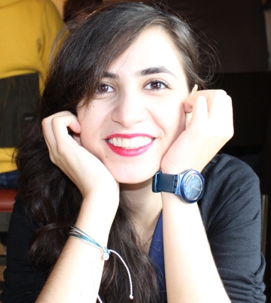

I received my PhD in Cognitive and Information Sciences from the University of California, Merced, in 2023, under the guidance of Dr. Tyler Marghetis and Dr. Carolyn Dicey Jennings. Currently, I work as the lead data scientist for a network of charter schools in Southern California. In this role, I mentor junior data scientists and continue to enhance my expertise in statistical modeling and machine learning techniques.

My research focuses on the cognitive and neural mechanisms of creative problem-solving, particularly in math and science. I use innovative statistical methods from Bayesian analysis, information theory, and complex systems theory to explore how creativity emerges from the interactions between the brain, body, and environment. Additionally, I have proposed a novel approach to studying the neural and attentional mechanisms of creativity by examining both the source (top-down/bottom-up) and the target (internal/external) of attention, which provides a better explanation for the variance in real-world creativity. I have also investigated the impact of digital technologies, such as social media, on creative cognition and its underlying mechanisms. My research takes an interdisciplinary approach, integrating cognitive psychology, data science, and neuroscience. My latest work applies statistical methodologies from information theory and complex systems theory to build a formal model of creative insights in mathematics

